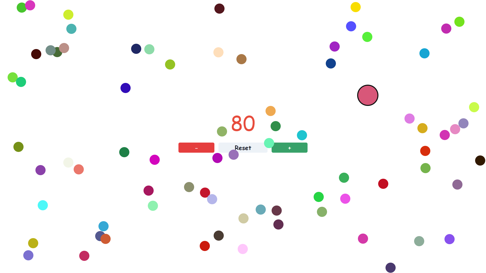

# Contador de Pelotas

Un contador interactivo de pelotas desarrollado con React, Chakra UI y Framer Motion.

## Demo

Ve a [https://github.com/RodriiG28/Contador-Pelotitas](https://github.com/RodriiG28/Contador-Pelotitas) para ver una demostración en vivo.

## Capturas de Pantalla

_Inserta capturas de pantalla o gifs animados para visualizar el proyecto en acción._

## Tecnologías Utilizadas

- [React](https://reactjs.org/)
- [Chakra UI](https://chakra-ui.com/)
- [Framer Motion](https://www.framer.com/motion/)

## Características

- Incrementa y decrementa el contador de manera interactiva.
- Elimina pelotas haciendo clic en ellas.
- Experiencia mejorada con efectos de animación atractivos.

#--Rodrigo Avila--